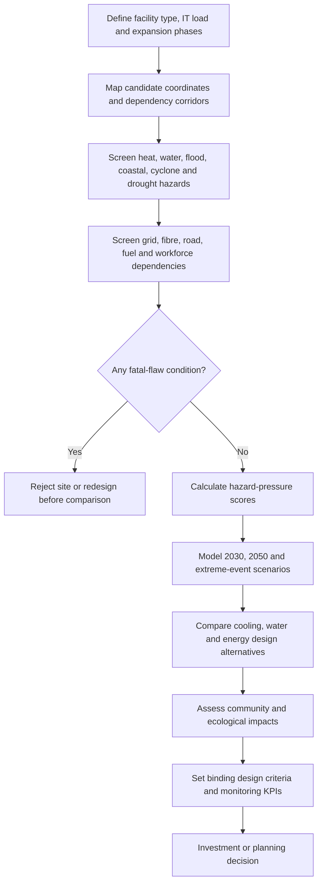
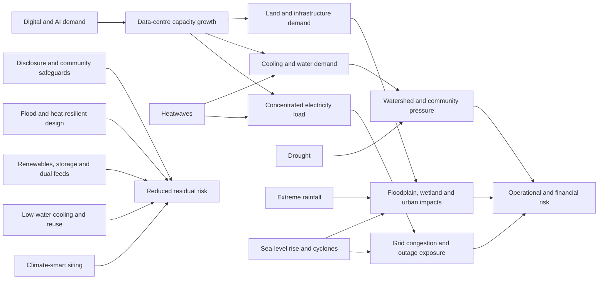

# Building a Climate-Risk Case Study for Data Centres in India

## Executive summary

India’s data-centre expansion should be framed not simply as an energy-consumption story, but as a **place-specific climate and infrastructure pressure story**. The country’s operational data-centre capacity increased from roughly 375 MW in 2020 to about 1,500 MW in 2025, and the Ministry of Power estimates that data-centre electricity demand could reach 13.56 GW by 2031–32. Most capacity is concentrated in a small number of metropolitan clusters: Mumbai–Navi Mumbai, Chennai, Hyderabad, Bengaluru and Delhi NCR–Noida. This concentration creates operational efficiency and connectivity benefits, but also concentrates exposure to urban flooding, extreme heat, water stress, coastal inundation, cyclones and overloaded local infrastructure. citeturn14view1turn14view3turn17view0

The central case-study proposition should therefore be:

> **India’s data-centre boom is creating a new class of climate-critical infrastructure whose resilience depends on simultaneous access to reliable electricity, sustainable water, climate-safe land, telecommunications connectivity and public legitimacy.**

The most compelling evidence is the scale and pace of expansion. Cushman & Wakefield counted approximately 1,280 MW of operational capacity in the first half of 2025, with 638 MW under construction and another 2,249 MW planned. Mumbai accounted for 46% of operational capacity and 41% of the future pipeline; Chennai, Hyderabad, Delhi NCR and Bengaluru comprised most of the remainder. A later CBRE estimate placed national capacity at approximately 1,530 MW by September 2025, illustrating both continuing growth and differences in market definitions and reporting dates. citeturn3view0turn4view0turn4view1turn14view3

Electricity is the most visible resource pressure. Recent published estimates place Indian data-centre electricity use in 2024 at between approximately 0.5% and 0.8% of national consumption. CEEW estimates demand could rise from around 13 TWh in 2024 to 57 TWh in 2030, while the government’s 13.56 GW projection for 2031–32 indicates that peak and firm-capacity requirements may become substantially larger than historical sector forecasts. These loads are unusually concentrated: a single hyperscale campus can exceed 100 MW, comparable to a large industrial complex but requiring much higher power quality and continuity. citeturn14view0turn14view1turn17view0turn19view2turn13search3

Water is the least transparent and potentially most contentious pressure. India has no comprehensive official national dataset reporting data-centre withdrawals, consumption, source, discharge or monthly water-use effectiveness. Published estimates consequently vary markedly. CEEW has cited approximately 800,000 litres per day for a typical 100 MW facility using water-based evaporative cooling in one analysis and approximately two million litres per day in a later white paper. A UK government review gives a much higher upper-order estimate—around 2.5 billion litres annually for a 100 MW facility—demonstrating how assumptions about utilisation, climate, heat-rejection design, water-use boundaries and indirect electricity-related water can radically change the result. The case study should present a range rather than a single universal number. citeturn14view0turn18view1turn19view0turn19view4turn2view3

Water risk is geographically material. WRI India reported in 2026 that more than half of India’s data centres are located in water-stressed regions. Chennai, Bengaluru, Hyderabad and Delhi NCR should be treated as very-high-priority water-risk screening locations; Mumbai–Navi Mumbai has greater monsoon rainfall and reservoir access but still faces high metropolitan demand, drought-year restrictions and dependence on distant catchments. WRI’s Aqueduct 4.0 is well suited to initial comparison, but WRI explicitly cautions that it is a prioritisation tool rather than a substitute for local watershed, utility and groundwater assessment. citeturn9search0turn21view2turn22search1turn23view0

The regional risk pattern is differentiated:

| Cluster | Dominant climate-risk proposition |
|---|---|
| **Mumbai–Navi Mumbai** | The country’s largest capacity concentration is exposed to compound coastal, pluvial-flood, sea-level, humidity and infrastructure-congestion risks. |
| **Chennai** | Strong cable connectivity and data-centre growth coincide with cyclone, coastal-flood, extreme-rainfall, heat and chronic water-security risks. |
| **Hyderabad** | Inland hyperscale growth is exposed to extreme heat, drought and water competition, while intense rainfall and loss of urban drainage create flash-flood risk. |
| **Bengaluru** | Digital-industry concentration is constrained by water scarcity, groundwater dependence, extreme rainfall, lake and drainage encroachment, heat and local grid limitations. |
| **Delhi NCR–Noida** | Severe heat, high cooling demand, water stress, Yamuna and urban flooding, air pollution and summer peak electricity demand combine into a high-pressure inland risk profile. |

These are not reasons to reject the regions outright. They are reasons to move from a generic “is the city attractive?” analysis to a **site-by-site climate-pressure test** that examines the watershed, substation, floodplain, drainage network, cooling design, water source, community context and recovery pathways.

The recommended climate-hazard pressure screening tool should combine seven dimensions: heat; water scarcity and drought; pluvial, fluvial and coastal flooding; cyclone and wind; grid and fuel resilience; land, ecology and community pressure; and supply-chain and telecommunications dependencies. It should use “fatal-flaw” gates before calculating a composite score. For example, a site should not pass merely because a weighted average is acceptable if it occupies a wetland, relies on potable water in an extremely stressed basin, has only one flood-exposed substation, or places critical plant below projected flood levels.

The case study should avoid presenting “liquid cooling” as automatically water-free. Direct-to-chip and immersion systems can reduce server-side cooling energy and may operate in a closed loop, but the facility may still reject heat through evaporative cooling towers. The correct distinction is between **heat capture at the rack** and **ultimate heat rejection to the environment**. Technology must therefore be evaluated using combined power usage effectiveness, water usage effectiveness, source-water quality, annual consumption and peak-season performance. citeturn14view0turn19view4turn2view3

The strongest policy conclusion is that incentives for data-centre construction should be conditional on resource and resilience performance. India lacks a binding national data-centre sustainability framework, while only five of fifteen identified state data-cententre policies explicitly embed sustainability provisions. A credible framework would require facility-level reporting of electricity, hourly or monthly renewable-energy matching, water withdrawal and consumption by source, water usage effectiveness, cooling architecture, climate-risk assessment and emergency-resource dependence. citeturn17view0turn16search3

## Case-study thesis and hazard-pressure screening method

### The analytical lens

A conventional data-centre location study normally prioritises fibre connectivity, customer proximity, land price, tax incentives and electricity availability. A climate-risk case study should retain those factors but ask a different question:

> **How much additional pressure will the facility place on already stressed natural and infrastructure systems, and how will those systems behave during coincident climate extremes?**

This distinction matters because hazard exposure is not the same as operational risk. A data centre may be outside a mapped river floodplain yet remain exposed because its electricity substation, access road, fuel depot, workforce transport route or cable landing station is vulnerable. Similarly, a facility may hold a valid water allocation but still face reputational and operating risk if withdrawals compete with domestic supply during drought.

A practical risk formulation is:

\[
\text{Climate pressure} =
\frac{\text{Hazard intensity} \times \text{Exposure} \times \text{Operational sensitivity} \times \text{system criticality}}
{\text{adaptive capacity}}
\]

The calculation should be performed separately for each hazard and dependency rather than immediately collapsing everything into one score. A composite score is useful for portfolio comparison, but it can conceal non-negotiable risks.

### Recommended screening architecture

| Screening module | Core indicators | Operational transmission pathway | Primary datasets |
|---|---|---|---|
| **Heat and humidity** | Historical and projected maximum temperature; heatwave days; wet-bulb temperature; hot-night frequency; urban heat-island intensity | Higher cooling electricity; reduced dry-cooling performance; lower transformer and generator efficiency; worker exposure | IMD Climate Hazard and Vulnerability Atlas; MoES climate assessment; downscaled CMIP6; local weather stations |
| **Water scarcity and drought** | Aqueduct baseline water stress; seasonal stress; drought risk; groundwater extraction category; reservoir reliability; water-quality constraints | Cooling curtailment; tanker dependence; higher treatment cost; community conflict; permit restrictions | WRI Aqueduct 4.0; CGWB groundwater assessments; municipal water boards; DST district drought-risk maps |
| **Flooding** | Pluvial, riverine and coastal flood depth; duration; drainage capacity; site elevation; flood history; wetland and lake change | Damage to switchgear, generators and cooling plant; loss of access; cable or substation outage; fuel contamination | DST district risk assessment; IMD Atlas; municipal flood models; state disaster-management plans; satellite elevation and land-cover data |
| **Coastal and cyclone** | Sea-level rise; land subsidence; storm surge; extreme wind; salt corrosion; coastal erosion | Structural damage; prolonged grid and cable outages; inundation; corrosion; restricted site access | MoES and INCOIS coastal products; IMD cyclone climatology; peer-reviewed sea-level studies |
| **Electricity resilience** | Utility adequacy; feeder SAIDI/SAIFI; dual-substation availability; N-1 capability; substation flood exposure; restoration time; renewable curtailment | Service interruption; diesel operation; emissions; SLA penalties; equipment damage | CEA dashboards and planning reports; utility records; site electrical studies |
| **Land, ecology and community** | Wetland or mangrove conversion; impervious surface increase; proximity to settlements; competing water users; displacement; local employment and fiscal benefits | Flood amplification; loss of ecosystem services; opposition and delays; inequitable allocation of public resources | State land records; wetland inventories; Census and local socioeconomic data; consultation |
| **Supply chain and connectivity** | Number of fibre and cable routes; cable-landing exposure; road and port dependencies; spare-parts lead time; diesel logistics | Common-mode outage; delayed repair; inventory shortage; prolonged backup operation | Operator records; submarine-cable maps; port and highway hazard assessments |

India’s official and public hazard infrastructure is sufficiently developed to support a first-stage screen. IMD’s Climate Hazard and Vulnerability Atlas contains hundreds of maps covering thirteen hazardous meteorological events. DST’s district-level assessment maps flood and drought risk using the IPCC framework of hazard, exposure and vulnerability. WRI Aqueduct provides globally comparable baseline and future water-risk indicators, while CGWB provides authoritative groundwater-resource assessments. citeturn0search19turn20search0turn20search1turn21view2turn16search1

### Proposed scoring system

A transparent 0–5 score can be assigned to each sub-indicator:

| Score | Interpretation |
|---:|---|
| 0 | Negligible or no material pressure identified |
| 1 | Low; standard engineering controls sufficient |
| 2 | Moderate; additional design and monitoring required |
| 3 | High; material capital and operating implications |
| 4 | Very high; specialist mitigation and binding operating conditions required |
| 5 | Critical or potentially incompatible with the proposed design |

A starting weighting for a hyperscale Indian facility could allocate 20% each to water and flooding, 15% each to heat and electricity resilience, 10% each to coastal/cyclone exposure and land/community pressure, and 10% to connectivity and supply-chain dependencies. These weights should change by facility type. An inland enterprise facility may place more weight on grid quality; a coastal hyperscale facility near a cable landing station may place more weight on cyclone, inundation and common-mode network failures.

### Fatal-flaw gates

The following should be treated as decision gates rather than factors that can be offset by a favourable average score:

- The site lies in an active wetland, mangrove, natural drainage corridor or high-probability floodway.
- Critical electrical or cooling infrastructure would be below the climate-adjusted design-flood elevation.
- The facility has no physically independent grid supply or no credible islanding and restoration strategy.
- Potable or groundwater-based evaporative cooling is proposed in an extremely water-stressed basin without binding reclaimed-water substitution.
- Water availability is based on annual averages rather than dry-season firm yield.
- The project depends on a single cable route, access road, substation or fuel-supply corridor exposed to the same hazard.
- Cooling performance has been assessed using historical weather files only, without future heat and humidity allowances.
- The project’s water allocation would impair domestic-service obligations or environmental flows during drought.

WRI emphasises that Aqueduct should be used to identify priorities for deeper local analysis, not as a final site verdict. The same principle applies to all national hazard datasets: the final decision requires engineering surveys, utility data, flood modelling and community consultation at the actual site coordinates. citeturn22search1turn23view0

### Recommended decision sequence

## Evidence base on scale, electricity, water and land

### Capacity and geographic concentration

India’s capacity figures vary because commercial analysts use different definitions of operational IT load, commissioned shell capacity, under-construction capacity and announced projects. The most defensible approach is to show a range and identify the reporting date.

| Indicator | Recent estimate | Interpretation |
|---|---:|---|
| Operational national capacity, H1 2025 | **1,280 MW** | Cushman & Wakefield count of operating facilities citeturn3view0turn14view2 |
| Under construction, H1 2025 | **638 MW** | Projects actively being delivered citeturn3view0 |
| Planned capacity, H1 2025 | **2,249 MW** | Announced or proposed future supply; delivery risk remains citeturn3view0turn4view0 |
| Operational capacity, September 2025 | **Approximately 1,530 MW** | CBRE’s later market estimate citeturn14view3 |
| Government historical series | **About 375 MW in 2020 to 1,500 MW in 2025** | Official national growth statement citeturn14view1 |
| CEEW projection for 2030 | **Approximately 4.5–6.5 GW** | Consolidated market projection, subject to power, land and project delivery constraints citeturn17view0turn19view3 |
| Wider market projection range | **Approximately 6.5–17 GW by 2030** | Demonstrates substantial uncertainty around AI demand and announced megaprojects citeturn14view0 |
| Ministry of Power estimate for 2031–32 | **13.56 GW of electricity demand** | Planning estimate rather than a count of commissioned IT load citeturn14view1 |

The market is highly concentrated. Mumbai held 46% of operational capacity in Cushman & Wakefield’s H1 2025 dataset. Chennai accounted for 15%, Delhi NCR and Hyderabad 11% each, Pune 9% and Bengaluru 6%. Mumbai also represented 41% of upcoming supply, followed by Hyderabad at 19%, Chennai at 13% and Delhi NCR at 8%. citeturn3view0turn4view0turn4view1

This concentration is partly explained by cable landings, fibre density, cloud-customer demand, financial and technology ecosystems, land availability and state incentives. India had approximately seventeen international subsea cables landing at fourteen stations in coastal locations including Mumbai, Chennai, Kochi, Thoothukudi and Thiruvananthapuram, reinforcing the attraction of Mumbai and Chennai for hyperscale and latency-sensitive facilities. citeturn19view3

### Electricity demand and grid implications

CEEW estimates that Indian data-centre electricity demand could increase from approximately 13 TWh in 2024 to 57 TWh in 2030. That would raise the sector’s share of national electricity use from around 0.8% to approximately 2.6% under its assumptions. A separate 2026 CEEW white paper cites a lower 2024 share of around 0.5%, indicating that the underlying national baseline, facility inventory and treatment of captive or backup power remain unsettled. The case study should therefore treat 0.5–0.8% as a published estimate range rather than an audited national statistic. citeturn14view0turn17view0turn19view2

The grid challenge is not solely the total energy volume. Data centres require continuous, high-quality electricity and add large load blocks at individual substations. Servers and cooling systems together can account for nearly 70% of facility electricity consumption, although the proportion varies by climate, workload and cooling design. Even brief interruptions can trigger outages, service-level penalties or generator operation. CEEW’s industry consultations also identified evacuation and grid-capacity constraints in major data-centre clusters. citeturn19view2turn19view4

At the national level, CEA’s Load Generation Balance Report for 2026–27 anticipates an energy surplus of 2.5% and a peak surplus of 4.1%. This does not mean every data-centre site has a reliable connection. National and state energy adequacy can coexist with feeder interruptions, local transmission congestion, substation flooding or insufficient dual-feed capacity. CEA accordingly promotes feeder-level monitoring of SAIDI and SAIFI and N-1-oriented network planning. citeturn25search0turn25search1turn25search25

The case study should distinguish four electricity questions:

| Question | Appropriate metric |
|---|---|
| Is sufficient annual electricity available? | State and regional energy balance |
| Can the system serve the facility’s maximum load? | Peak demand, substation MVA and transmission headroom |
| Will service remain available during faults or hazards? | N-1 configuration, independent feeders, SAIDI, SAIFI and restoration time |
| Is the electricity genuinely low-carbon? | Hourly generation mix, additional renewable procurement, storage and residual grid emissions |

### Water demand and uncertainty

Data-centre water use occurs through at least three pathways: direct facility cooling and humidification; water used in electricity generation; and water embedded in semiconductor and equipment manufacturing. Public debate often combines these boundaries, generating apparently contradictory figures. citeturn2view3

CEEW’s 2026 white paper reports that a typical 100 MW hyperscale facility can consume approximately two million litres per day for on-site cooling. Its earlier India-focused analysis used approximately 800,000 litres per day for a water-based evaporative design. A UK government review cites an upper-order estimate of approximately 2.5 billion litres per year for a 100 MW facility. The variation is technically plausible because water use depends on IT utilisation, ambient wet-bulb temperature, cycles of concentration, chiller configuration, cooling-tower operation, water quality and whether indirect consumption is included. citeturn14view0turn19view0turn19view4turn2view3

A useful way to avoid false precision is to calculate scenarios using water usage effectiveness, normally expressed as litres per kilowatt-hour of IT electricity:

\[
\text{Annual direct water use} =
\text{IT load in MW} \times 8{,}760 \times 1{,}000
\times \text{IT utilisation} \times \text{WUE}
\]

For an illustrative 100 MW facility operating at an 85% average IT load:

| Direct WUE | Annual direct water consumption | Daily equivalent |
|---:|---:|---:|
| 0.2 L/kWh | 149 million litres | 0.41 million litres |
| 0.5 L/kWh | 372 million litres | 1.02 million litres |
| 1.0 L/kWh | 745 million litres | 2.04 million litres |
| 1.8 L/kWh | 1.34 billion litres | 3.67 million litres |

These are analytical scenarios, not estimates for any named facility. They exclude indirect water associated with power generation and equipment production. They show why a project’s declared IT load is insufficient for assessing water risk: the case study also needs average utilisation, cooling mode by hour, source-water mix and WUE during hot and dry months.

Published aggregate estimates should be handled cautiously. CEEW cited approximately 150 billion litres of Indian data-centre water use in 2024, drawn from a commercial market estimate rather than a national metering programme. Operator disclosures provide useful evidence but are not necessarily comparable. Down To Earth reported that STT GDC’s global water withdrawal was 1,149,020 kilolitres in 2024 and that its reported Indian withdrawal was 419,204 kilolitres in 2023. Boundaries, floor area, IT load, occupancy and treatment of recycled water must be normalised before comparing operators. citeturn17view0turn19view2turn16search6

India currently lacks mandatory, facility-level sector reporting for electricity and water performance. The government notes that water requirements vary by cooling system and that groundwater extraction falls under Central Ground Water Authority guidelines, but these controls do not by themselves provide a consistent national data-centre water inventory. CEEW has recommended mandatory reporting and updated energy and water benchmarks. citeturn14view0turn14view1

### Heat, flooding and climate change

The Ministry of Earth Sciences’ national climate assessment found that India’s average surface temperature rose by approximately 0.7°C between 1901 and 2018, while the tropical Indian Ocean warmed by about 1°C between 1951 and 2015. Warmer air raises cooling loads and can increase the intensity of heavy rainfall; warmer coastal waters and sea-level rise add to coastal-flood and cyclone-related exposure. citeturn5search2turn12search3turn12search31

CEEW reports that 57% of Indian districts face high to very high extreme-heat risk and cites evidence that 72% have experienced extreme flood events. Its data-centre research explicitly identifies heat stress, flooding, cyclone, wind and coastal inundation as material siting considerations. citeturn14view0turn19view4

Academic research published during the past decade supports the city-level concerns. Studies have examined increasing temperature extremes across Indian metropolitan clusters, urbanisation-amplified rainfall and flooding in Chennai, rising coastal exposure in Mumbai and Chennai, and increasingly intense extreme rainfall at basin and urban scales. The direction of evidence is clear even where precise local projections differ: historical design standards alone are unlikely to represent the lifetime conditions of facilities commissioned in the late 2020s. citeturn12search34turn12search38turn12search2turn12search6turn12search21

### Land use, ecosystems and social pressure

CEEW estimated that India hosted approximately 271 data centres by January 2026 and reported a real-estate footprint of around 23 million square metres. Large campuses also require substations, generators, fuel storage, cooling equipment, internal roads and security buffers, meaning the affected land area can exceed the building footprint. citeturn17view0turn19view3

Land conversion can amplify climate risk when construction occupies wetlands, flood-storage areas, lake buffers, mangroves or natural drainage channels. Impervious development increases runoff and transfers flood pressure downstream. The social issue is therefore not only how much land is acquired, but what hydrological and livelihood functions the land previously provided.

Water competition is likely to become the dominant community narrative. CEEW warns that locating facilities in already stressed regions can increase pressure on local communities and affect long-term operational viability. Smaller facilities may depend heavily on municipal supply, while larger projects may secure dedicated allocations, pipelines or tanker supplies that are difficult for affected residents to scrutinise. citeturn19view1turn19view4

The case study should examine distributional questions explicitly: who receives reliable water and electricity, who bears flood or pollution externalities, what public infrastructure is subsidised, how many durable local jobs are created, and whether community needs are protected during drought or outages.

## Regional cluster comparison

### Comparative screening table

The water-stress scores below are **indicative Aqueduct-style screening bands**, not audited point values. Aqueduct scores range from 0 to 5, with higher values indicating higher pressure; exact results vary by site coordinate, sub-basin and scenario. Before publication, the case-study team should upload the actual facility coordinates to Aqueduct and validate the result against municipal and CGWB data. WRI itself cautions that Aqueduct is a prioritisation tool requiring local follow-up. citeturn22search0turn22search1turn22search4turn22search12

“Grid reliability” is similarly a screening proxy. Comparable city-level SAIDI and SAIFI data are not consistently available publicly, so the assessment combines bulk-system adequacy, market infrastructure and climate exposure. It must be replaced at due-diligence stage with feeder and substation evidence.

| Region | Operational capacity, H1 2025 | Under construction and planned | Principal hazard exposure | Indicative water-stress band | Grid adequacy and resilience proxy |
|---|---:|---:|---|---|---|
| **Mumbai–Navi Mumbai** | **594 MW** | **1,189 MW pipeline:** 337 MW under construction and 852 MW planned citeturn3view0turn4view2 | Very high pluvial and coastal-flood exposure; sea-level rise; high humidity; extreme rainfall; cyclone and wind exposure; salt corrosion; access and substation flooding | **High, approximately 3–4/5**, with strong seasonal and metropolitan-demand sensitivity; coordinate verification essential | **High bulk adequacy; medium climate resilience.** Mature power and connectivity market, but concentrated coastal assets create common-mode flood and storm risk |
| **Chennai** | **191 MW** | **376 MW pipeline:** 57 MW under construction and 319 MW planned citeturn15view1 | Cyclone, storm surge, coastal and urban flooding, sea-level rise, extreme rainfall, heat, drought and water-supply volatility | **Extremely high, approximately 4–5/5** | **High bulk adequacy; medium climate resilience.** State policy supports dual grid supply for large projects, but cyclone and flood exposure must be tested at substation and route level citeturn17view4 |
| **Hyderabad** | **135 MW** | **540 MW pipeline:** 94 MW under construction and 446 MW planned citeturn15view0 | Extreme heat, drought and water competition; high-intensity rainfall; flash flooding along lakes, nalas and the Musi system; urban heat-island growth | **High to extremely high, approximately 4–5/5** | **Medium-high bulk adequacy; medium local resilience.** Rapid planned load growth and summer cooling demand warrant substation-level headroom and restoration analysis |
| **Bengaluru** | **76 MW** | **106 MW pipeline:** 19 MW under construction and 87 MW planned citeturn15view3turn15view4 | Water scarcity and groundwater pressure; extreme rainfall and urban flooding; lake and drainage loss; heat; constrained land and access | **Extremely high, approximately 4–5/5** | **Medium-high bulk adequacy; medium local resilience.** Distributed technology load and urban network constraints require dual feeds, on-site storage and drainage review |
| **Delhi NCR–Noida** | **146 MW** | **233 MW pipeline:** 24 MW under construction and 209 MW planned citeturn15view2 | Severe heatwaves and hot nights; high cooling peaks; water stress; riverine and pluvial flooding; dust and air pollution; drought | **Extremely high, approximately 4–5/5** | **High bulk adequacy; medium-high site resilience.** Strong transmission access, but exceptional summer peak conditions and urban-flood exposure can affect feeders and backup systems |

### Mumbai–Navi Mumbai

Mumbai is the national market’s centre of gravity. Its connectivity, customer base and mature ecosystem are major advantages, but approximately 594 MW of operational capacity and more than one gigawatt of pipeline create a concentration risk. A climate event affecting power substations, cable landings, access roads or cooling-water infrastructure could affect multiple operators simultaneously. citeturn3view0turn4view2

The most important framing is **compound coastal-urban risk**. Heavy monsoon rainfall can coincide with high tides and restricted drainage; sea-level rise raises the baseline upon which storm surge and tidal flooding operate. Research on Indian coastal cities identifies Mumbai among the locations particularly susceptible to relative sea-level change. Recent research also indicates that local land subsidence can materially increase relative sea-level exposure in parts of the metropolitan region. citeturn12search2turn12search6turn12search17

Water risk should not be understated because of Mumbai’s high annual rainfall. Reservoir storage, seasonal monsoon reliability, transmission losses and domestic demand determine firm supply. Drought-year municipal restrictions and the dependence of peri-urban communities on uneven services make potable-water evaporative cooling reputationally sensitive.

A strong Mumbai case-study question is:

> Can the country’s largest digital-infrastructure cluster remain operational when extreme rainfall, high tide, grid disruption and restricted physical access occur together?

### Chennai

Chennai combines subsea-cable connectivity and industrial policy support with one of the most complex climate profiles. Its hazards include cyclones, storm surge, sea-level rise, urban and river flooding, extreme rainfall, heat and recurring water scarcity. Research has shown that urban expansion and impervious development can increase future flood risk, while coastal studies identify Chennai as highly exposed to sea-level inundation. citeturn12search38turn12search14turn12search2

The key narrative is **alternation between too little and too much water**. Drought and reservoir depletion constrain supply, while intense rainfall overwhelms drainage and threatens facilities. A design optimised only for annual rainfall or only for historic cyclone standards misses this duality.

Tamil Nadu’s Data Centre Policy recognises the sector’s power intensity, encourages renewable electricity and offers incentives to projects meeting at least 30% of consumption from renewable sources. It also states that facilities with sanctioned load of 50 MW or more should receive dual power from different grid locations or providers, and that projects above 100 MW may obtain an additional feeder. These are useful policy precedents, although physical independence and flood exposure must be verified rather than assumed from policy eligibility. citeturn17view4

### Hyderabad

Hyderabad’s capacity pipeline—approximately 540 MW in the Cushman & Wakefield dataset—is four times its H1 2025 operational base. This creates a forward-looking planning issue: historical utility and water demand may provide little indication of future cumulative pressure. citeturn15view0

The primary hazards are extreme heat and water scarcity, combined with intense-rainfall flooding. Heat raises both IT cooling load and wider city electricity demand, increasing the chance that a facility’s peak coincides with the grid’s peak. Water use must be tested against dry-season availability and competing municipal and agricultural demands, not merely annual allocations.

Urban flooding is also material. A recent Hyderabad vulnerability study reported that substantial portions of the city fall in high or very high flood-vulnerability classes, associating the risk with concretisation, shrinking drainage space, lakes and poorly functioning stormwater infrastructure. citeturn20news40

The Hyderabad case-study question should be:

> How does a rapidly expanding inland data-centre cluster manage the coincidence of summer heat, high grid demand and constrained water, while remaining prepared for short-duration extreme rainfall?

### Bengaluru

Bengaluru’s data-centre market is smaller than Mumbai’s or Chennai’s but strategically important because of the concentration of cloud, software, AI and enterprise demand. Its dominant constraint is the interaction of water insecurity, groundwater pressure, land-use change and urban flooding.

The apparent contradiction between water scarcity and flooding is central to the narrative. Heavy rainfall does not automatically create usable water when catchments, lakes and groundwater recharge systems are degraded, while impervious surfaces and encroached drains increase runoff. A facility may therefore be exposed to both supply shortage and flood damage within the same year.

The case study should test municipal, groundwater, tanker and recycled-water dependencies separately. Groundwater NOCs and annual availability figures should not be treated as proof of long-term sustainable yield. CGWB’s national assessments classify groundwater units using extraction and recharge conditions and provide the authoritative starting point for local review. citeturn16search1turn16search15

### Delhi NCR–Noida

Delhi NCR combines strong market access and grid infrastructure with the most severe heat profile among the principal clusters. Prolonged heatwaves, hot nights, dust and air pollution affect cooling performance, workers, filtration systems, generators and the wider electricity system. Research on temperature extremes across Indian city clusters confirms the importance of future heat exposure for Delhi as well as Mumbai and Chennai. citeturn12search34

Water stress is high, while both Yamuna flooding and local pluvial flooding can affect infrastructure. The relevant boundary should include Noida and Greater Noida drainage, substations, access routes and upstream water sources rather than only the data-centre plot.

The Delhi NCR narrative should emphasise **peak coincidence**: the hottest days generate exceptional cooling demand inside the facility while air-conditioning, pumping and other loads are peaking across the region. Backup-generation air emissions are also more socially material in a region with severe air-quality problems.

## Narrative frames, headlines and audience versions

### Common industry and media framing

Coverage of data centres generally falls into five recurring frames.

The **growth and investment frame** presents data centres as the backbone of AI, cloud adoption and digital sovereignty. It focuses on capacity, investment and construction pipelines. Representative headlines include JLL’s “India’s Data Centre Capacity to Reach 1.8 GW by 2027”, CBRE’s “Mumbai Leads India’s Data Centre Capacity with a 53% Share YTD”, and Cushman & Wakefield’s “India’s Data Centre Sector Is Scaling for a Digital Future”. citeturn0search1turn14view3turn14view2

The **resource-constraint frame** contrasts rapid expansion with power, water and land limits. Reuters used the formulation “$100 billion data centre boom tests resource limits”, while CEEW asked, “Why Is Water-Based Cooling a Big Issue for AI Data Centres in India?” citeturn0news40turn14view0

The **locational-risk frame** asks whether the industry is building in places already exposed to water stress, flooding or heat. WRI India’s headline, “More Than Half of India’s Data Centres Are in Water-Stressed Regions”, is especially effective because it converts a technical geospatial result into a clear public-interest proposition. citeturn9search0

The **technology-solution frame** focuses on liquid cooling, renewables, recycled water and green-building certification. It can be constructive but often becomes overly promotional if it does not report absolute resource use or explain the final heat-rejection system.

The **community and justice frame** asks who benefits and who bears the cost. It focuses on domestic water access, electricity tariffs, land conversion, diesel emissions, jobs and public subsidies. This frame remains less developed in Indian industry publications but is likely to become more prominent as campuses scale.

### Headline bank for the case study

These are original headline options modelled on the strongest industry and public-interest conventions:

| Narrative emphasis | Suggested headline |
|---|---|
| National overview | **India’s Data-Centre Boom Is Becoming a Climate-Infrastructure Test** |
| Water | **The Cloud Has a Watershed: Mapping India’s Data Centres Against Water Stress** |
| Power | **From Megawatts to Gigawatts: Can India’s Grid Keep the Cloud Online?** |
| Location | **Five Digital Hubs, Five Climate-Risk Profiles** |
| Coastal concentration | **Cable Landings and Rising Seas: The Climate Trade-Off Facing Mumbai and Chennai** |
| Inland risk | **Heat, Water and the Hyperscale Interior: Hyderabad, Bengaluru and Noida** |
| Investment | **The Hidden Location Risk in India’s Data-Centre Pipeline** |
| Community | **Whose Water Cools the Cloud? Data Centres and Urban Resource Competition in India** |
| Solutions | **Beyond ‘Green Data Centres’: What Climate-Resilient Digital Infrastructure Requires** |
| Screening tool | **A Climate Pressure Test for India’s Next Data-Centre Campus** |

### Sample opening paragraphs

#### Growth-to-risk opening

> India is building the physical infrastructure of the cloud at industrial scale. Data-centre capacity rose from roughly 375 MW in 2020 to about 1.5 GW in 2025, and government planners now expect sector electricity demand to reach 13.56 GW by 2031–32. Yet most of this expansion is being concentrated in a handful of cities already contending with heatwaves, water stress, urban flooding or coastal hazards. The question is no longer whether India’s data-centre market will grow, but whether the places hosting that growth can support it through a hotter and more volatile climate. citeturn14view1turn19view4

#### Place-based opening

> Navi Mumbai appears to offer almost everything a hyperscale operator needs: proximity to cable landings, a deep customer market, established power infrastructure and a rapidly growing data-centre ecosystem. It is also part of a low-lying coastal metropolis where intense monsoon rainfall, tidal conditions, sea-level rise and infrastructure congestion can interact. A site that performs well on a conventional real-estate scorecard may therefore look very different when the analysis follows its electricity, water, fibre and access dependencies beyond the property boundary.

#### Water-and-community opening

> Data centres are often described as weightless infrastructure, but their cooling systems are rooted in local watersheds. In an Indian city, the same water system may serve households, hospitals, informal settlements, industry and a new hyperscale campus. When drought occurs, a technically valid allocation can become a political and social risk. A meaningful assessment must therefore ask not only how many litres a facility will use, but where that water comes from, who else depends on it and what happens during the driest month.

#### Investor-risk opening

> The largest climate exposure in a data-centre investment may sit outside the server hall. A flood-prone substation, a single water pipeline, a common cable corridor or a cooling system that loses efficiency during extreme heat can turn a seemingly resilient building into a stranded or underperforming asset. As India’s pipeline moves from hundreds of megawatts to multi-gigawatt campuses, climate due diligence must expand from building certification to the reliability of whole urban and regional systems.

### Recommended case-study structures

#### The “boom versus limits” structure

This is best for media and general readers. Begin with capacity and investment growth, reveal the power and water requirements, map these demands onto climate-stressed cities, and conclude with policy choices. The narrative tension is the contrast between digital ambition and physical resource constraints.

#### The “five cities, five risk profiles” structure

This is best for a visual report. Each city becomes a short chapter with a cluster map, capacity figure, hazard profile, water and grid assessment, and an illustrative facility pathway. A concluding matrix compares the clusters and shows that “India risk” is not uniform.

#### The “journey of a unit of compute” structure

This is effective for technical and public audiences. Follow an AI workload through electricity generation, grid transmission, servers, cooling, water treatment and heat rejection. It makes indirect impacts and system boundaries visible.

#### The “investment decision” structure

This is best for investors and developers. Start with candidate-site screening, present fatal flaws, compare capital and operational mitigation costs, and show how poor siting can affect uptime, insurance, permits, water access and residual value.

#### The “watershed and community” structure

This is best for civil society and local engagement. Begin with the existing water system and users, add the project’s demand under normal and drought conditions, examine wastewater and recharge, and present enforceable safeguards.

### Key messages by audience

| Audience | Lead message | Evidence to emphasise | Avoid |
|---|---|---|---|
| **Policymakers** | Data-centre incentives should be conditional on climate-safe siting, transparent resource reporting and grid–water planning | 13.56 GW official electricity projection; concentrated capacity; absence of binding national sustainability rules; only a minority of state policies contain explicit sustainability provisions citeturn14view1turn17view0 | Treating all announced investment as automatically beneficial or assuming national grid surplus guarantees local readiness |
| **Investors and lenders** | Location and resource dependencies can affect uptime, operating cost, insurance, permitting and asset value | Site-specific flood and water exposure; substation and pipeline dependencies; divergence between announced and operating capacity | Relying only on green-building certification, annual renewable-energy certificates or city-level hazard ratings |
| **Local communities** | The relevant questions are water source, drought priority, land and flood effects, diesel pollution, jobs and disclosure | Monthly withdrawals and consumption; source-water mix; flood-drainage analysis; emergency operating plans; grievance mechanisms | Abstract PUE claims that do not explain absolute local effects |
| **Technical readers** | Cooling, power and water must be optimised as an integrated system under future climate conditions | Hourly weather, rack density, WUE, PUE, heat-rejection design, grid carbon intensity, water quality and cycles of concentration | Describing direct-to-chip cooling as inherently water-free |
| **Data-centre operators** | Early climate screening can reduce redesign, approval delays and operational constraints | Fatal-flaw gates; utility and watershed due diligence; design-flood and heat allowances | Selecting a site mainly on incentives and attempting to engineer around fundamental watershed or floodplain constraints |
| **Media and general readers** | The cloud has a physical footprint concentrated in climate-exposed cities | Capacity maps, relatable water scenarios, city comparisons and community impacts | Sensational single-facility water numbers without boundaries or assumptions |

## Mitigation and policy agenda

### Siting and planning

The highest-value mitigation is often **choosing a lower-pressure site**, not adding technology to a fundamentally unsuitable location. CEEW’s recommendations place siting alongside transparency, innovation and grid integration as one of four principal levers for sustainable growth. It recommends resource-risk profiling for water, land and energy and a data-driven decision-support tool for site selection. citeturn18view0turn17view0

Siting criteria should include:

- Climate-adjusted flood depth and duration for the site, substations, access roads and fibre routes.
- Current and projected dry-season firm water yield.
- Aqueduct, CGWB and local utility indicators, supplemented by community water-access data.
- Future design dry-bulb and wet-bulb temperatures.
- Independent substations and physically separated fibre routes.
- Avoidance of wetlands, mangroves, lake buffers and natural drainage corridors.
- Scope for reclaimed-water pipelines and renewable-energy connections.
- Cumulative impact from existing and planned facilities in the same cluster.

Maharashtra’s reported preference for coastal and peri-urban clusters such as Rabale, while slowing development in more water-stressed inland areas, suggests that resource conditions are already influencing decisions. CEEW cautions, however, that such considerations are not yet consistently codified as enforceable water-efficiency requirements. citeturn19view3

### Cooling and heat rejection

Cooling design should be selected using a multi-objective comparison of electricity, direct water consumption, indirect water, peak demand, reliability and climate performance.

| Option | Climate and resource benefit | Important limitation |
|---|---|---|
| **Improved air management and higher server inlet temperatures** | Low-cost reduction in fan and chiller energy; expands economiser hours | Requires IT-equipment compatibility and rigorous airflow containment |
| **Air-cooled chillers or dry coolers** | Very low direct water consumption | Higher electricity use and reduced efficiency during hot conditions |
| **Hybrid dry–wet cooling** | Can reserve evaporative operation for the hottest hours, reducing annual water use | Still requires water during precisely the periods when heat and drought may coincide |
| **Direct-to-chip liquid cooling** | Efficiently captures high-density rack heat and can reduce fan and chiller demand | Server loop may be closed, but external heat rejection can still consume water |
| **Immersion cooling** | High heat-transfer efficiency and reduced server-fan demand | Fluid compatibility, maintenance, supply-chain and end-of-life issues; facility heat rejection remains necessary |
| **Seawater or water-source cooling** | Potentially lowers mechanical cooling demand in suitable coastal settings | Marine impacts, corrosion, intake and discharge permitting, cyclone exposure and pumping energy |
| **Thermal storage** | Shifts cooling electricity and peak heat rejection away from stressed hours | Adds capital cost and requires controls and space |

CEEW notes that air cooling generally uses little or no direct water but can require more electricity, whereas water-based cooling is often more energy efficient but depends on reliable water. It identifies direct-to-chip, dielectric-plate and immersion cooling as promising, while noting cost, vendor, maintenance and supply-chain barriers. citeturn19view4

A UK government review found that direct-to-chip and some immersion configurations can materially reduce lifecycle water use relative to traditional air-cooled arrangements under particular assumptions. The result is design- and location-specific and should not be transferred to India without modelling electricity-source water and final heat rejection. citeturn2view3turn4view4

### Water circularity and source substitution

The first priority in a stressed basin should be **avoiding potable and groundwater use for routine cooling**, followed by reducing consumption and increasing recycling.

STT GDC India reports using non-potable sources where feasible, sewage-treatment and rainwater-harvesting systems, chiller-blowdown recovery, condensate reuse and zero-liquid-discharge-oriented design. It reports a Pune intervention involving higher cycles of concentration, conductivity optimisation and reuse of high-total-dissolved-solids water, alongside reduced raw-water procurement. These are useful operating examples, although project-level independently assured WUE and absolute consumption data remain necessary to judge performance. citeturn17view2

Recommended requirements include:

| Measure | Minimum evidence |
|---|---|
| Reclaimed municipal wastewater | Binding supply agreement; drought priority; treatment specification; pipeline resilience |
| Cooling-tower optimisation | Cycles of concentration, blowdown volume, water chemistry and scaling controls |
| Condensate and rainwater reuse | Monthly yield and realistic storage, rather than annual theoretical collection |
| Zero liquid discharge | Full energy, chemical, brine and sludge assessment; ZLD should not be assumed environmentally neutral |
| Water replenishment | Watershed-specific and additional projects; not a substitute for reducing withdrawals |
| Drought operating plan | Trigger levels, load-reduction sequence, alternative sources and community safeguards |
| Water disclosure | Withdrawal and consumption by source, monthly WUE, discharge quality and recycled-water percentage |

Google’s watershed-health framework offers a useful model for local assessment. It examines current and future community demand, available supply, water-level history, rationing, infrastructure feasibility, community access, regulation and climate trends before deciding whether water cooling is appropriate or whether reclaimed water or air cooling is preferable. citeturn26search13

### Electricity, renewables and resilience

Renewable electricity claims should be separated into three levels:

1. Annual contractual matching through power-purchase agreements or certificates.
2. Time-matched renewable supply supported by geographically diversified wind and solar.
3. Actual operational resilience through storage, grid support, islanding and independent supplies.

CEEW’s stakeholder research indicates that up to approximately 80% renewable supply may be feasible through geographically diversified solar and wind portfolios combined with battery storage. It also calls for storage pilots, demand-response integration and stronger grid planning. citeturn17view0turn18view0

STT GDC reported that renewable sources represented 59.6% of its Indian electricity mix in FY2025, delivered through a combination of long-term power-purchase agreements, green tariffs and energy-attribute certificates. At group level, it reported 78.5% renewable-energy usage in 2024. These examples demonstrate procurement feasibility but do not establish that supply was matched to consumption every hour or available during grid outages. citeturn26search9turn26search3

A resilient design should provide:

- Two physically independent substations where feasible.
- N-1 or stronger internal electrical architecture.
- Flood-protected switchgear and substations.
- Battery storage capable of supporting transition, power quality and selected critical loads.
- Renewable procurement with hourly matching and additionality metrics.
- Demand-response capability for non-critical cooling or computational loads.
- Black-start and islanding studies.
- Lower-emission backup options and limits on routine generator testing.
- On-site fuel security assessed against flood, heat and road disruption.

Tamil Nadu’s provision for dual power to facilities of 50 MW or more is a valuable starting precedent. Physical route diversity and common-mode climate exposure should nevertheless be verified through engineering drawings and site inspection. citeturn17view4

### Flood, cyclone and heat resilience

Flood protection should use projected conditions over the facility’s design life rather than a historic “100-year” level alone. Critical plant should be elevated above the climate-adjusted design flood with freeboard; basements should not contain irreplaceable electrical or communications equipment; drainage should include backflow protection and safe exceedance routes; and water, fuel and chemical tanks should be secured against flotation and contamination.

For coastal sites, design should address extreme wind, wind-driven rain, salt corrosion, storm surge, debris impact and the possibility that power, fibre and road infrastructure fail simultaneously. Mumbai and Chennai facilities should model compound rainfall–tide–surge scenarios, not each hazard independently.

Heat adaptation should include future weather files, hot-night conditions, wet-bulb extremes, derating of transformers and generators, filtration requirements, worker heat safety and cooling-system performance under water restrictions. The IMD Atlas and MoES climate assessment provide the national baseline, while local automatic weather-station and urban heat-island data should inform final engineering. citeturn20search8turn20search29turn5search2

### Social safeguards and public legitimacy

A technically efficient facility can still create social risk if resource allocation is opaque. The case study should recommend:

- Public disclosure of expected and actual water withdrawal and consumption.
- A prohibition on reducing domestic supply to meet data-centre demand during drought.
- Community consultation before water and land approvals.
- Independent review of wetland, drainage and flood impacts.
- Publication of emergency generator hours and emissions.
- Local grievance mechanisms with response timelines.
- Reporting of direct permanent jobs separately from temporary construction employment.
- Community-benefit investments linked to the affected watershed or electricity network.

The strongest safeguard is an enforceable drought-priority hierarchy. Recycled-water agreements should specify what happens if treatment plants fail or municipal wastewater volumes decline. Operators should not be permitted to shift automatically to potable water or unregulated tankers without disclosure and approval.

### National and state policy reforms

India does not yet have a binding national data-centre development policy. Fifteen states have introduced dedicated policies or used IT and industrial frameworks, but CEEW found that only five explicitly embed sustainability-related provisions. citeturn16search3turn17view0

A national green and resilient data-centre framework should require:

| Policy area | Recommended requirement |
|---|---|
| **Disclosure** | Facility-level IT load, electricity, PUE, water withdrawal, water consumption, WUE, source mix, renewable matching, backup generation and emissions |
| **Siting** | Mandatory climate-hazard and land–water–energy assessment before incentives or utility commitment |
| **Water** | Basin-sensitive WUE standards; potable-water restrictions in high-stress areas; monthly reporting; drought plans |
| **Energy** | Utility impact studies; dual-feed requirements for critical facilities; time-matched renewable targets; storage and demand-response readiness |
| **Flood and heat** | Climate-adjusted design criteria and independent certification of critical-equipment elevation |
| **Cumulative impacts** | Cluster-level assessment of planned—not only operating—electricity, water, land and drainage demand |
| **Incentives** | Tax, land and tariff incentives conditional on verified resource performance rather than project expenditure alone |
| **Transparency** | Public portal with comparable site-level environmental and resilience metrics |
| **Review** | Periodic tightening of benchmarks as cooling and IT technologies improve |

PUE alone is insufficient. A facility can improve PUE by using more evaporative cooling while increasing local water consumption. Policy should require PUE and WUE together, alongside absolute electricity and water use and a location-based water-stress indicator.

## Priority sources and visualisation plan

### Prioritised primary and authoritative sources

| Priority | Source and use | URL |
|---:|---|---|
| **Essential** | **Government of India, PIB: data-centre capacity, 2031–32 electricity-demand estimate and official water/cooling position** citeturn14view1 | https://www.pib.gov.in/PressReleasePage.aspx?PRID=2239616&lang=1&reg=3 |
| **Essential** | **CEEW, Scaling India’s Data Centre Ecosystem:** recent India-specific synthesis of capacity, siting, energy, cooling, policy and stakeholder evidence citeturn16search28turn17view0 | https://www.ceew.in/sites/default/files/ceew-data-centre-study-web-ready-final.pdf |
| **Essential** | **CEEW analysis of AI data centres, power and water:** electricity-demand projections, water scenario and governance gaps citeturn14view0 | https://www.ceew.in/blogs/why-is-water-based-cooling-a-big-issue-for-ai-data-centres-in-india |
| **Essential** | **Cushman & Wakefield India Data Centre Update H1 2025:** cluster maps and operational, under-construction and planned capacity citeturn3view0turn4view0turn4view1 | https://assets.cushmanwakefield.com/-/media/cw/apac/india/insights/indiadatacentreupdateh12025v4.pdf |
| **Essential** | **WRI Aqueduct Water Risk Atlas:** site-specific baseline and future water-stress screening citeturn21view2turn22search0 | https://www.wri.org/applications/aqueduct/water-risk-atlas/ |
| **Essential** | **WRI Aqueduct 4.0 dataset and methodology:** reproducible GIS data, risk bands and CMIP6 projections citeturn22search1turn22search12 | https://www.wri.org/data/aqueduct-global-maps-40-data |
| **Essential** | **DST District-Level Climate Risk Assessment:** official district flood and drought risk maps using the IPCC framework citeturn20search1 | https://dst.gov.in/sites/default/files/Full%20Report_District-Level%20Climate%20Risk%20Assessment%20for%20India_Mapping%20Flood%20and%20Drought%20Risks%20Using%20IPCC%20Framework.pdf |
| **Essential** | **IMD Climate Hazard and Vulnerability Atlas:** heatwave, flood, cyclone, heavy-rainfall and other hazard layers citeturn20search0turn20search8 | https://mausam.imd.gov.in/ |
| **Essential** | **CGWB Dynamic Ground Water Resources of India 2024:** groundwater recharge, extraction and assessment-unit classification citeturn16search1 | https://cgwb.gov.in/cgwbpnm/public/uploads/documents/17357169591419696804file.pdf |
| **Essential** | **MoES, Assessment of Climate Change over the Indian Region:** authoritative Indian temperature, rainfall, ocean, sea-level and cyclone science citeturn5search2turn20search18 | https://doi.org/10.1007/978-981-15-4327-2 |
| **High** | **CEA Load Generation Balance Report 2026–27:** national and state power adequacy; should be supplemented with utility data citeturn25search0 | https://cea.nic.in/wp-content/uploads/l_g_b_r_reports/2025/LGBR_2026_27.pdf |
| **High** | **CEA distribution planning and O&M guidelines:** SAIDI, SAIFI, feeder monitoring and network-resilience criteria citeturn25search1turn25search25 | https://cea.nic.in/wp-content/uploads/notification/2024/01/Final_Approved__Revised_Distribution_Planning_Criteria.pdf |
| **High** | **Tamil Nadu Data Centre Policy 2021:** renewable-energy incentives, dual-grid and additional-feeder provisions citeturn17view4 | https://www.nsws.gov.in/s3fs/2021-12/Data%20Centre%20Policy%202021.pdf |
| **High** | **Uttar Pradesh Data Centre Policy:** relevant to Noida and Greater Noida, including renewable open-access provisions citeturn16search13 | https://invest.up.gov.in/wp-content/uploads/2021/09/DC-Policy-2021-Eng-final_page-f.pdf |
| **High** | **Karnataka Data Centre Policy:** relevant to Bengaluru sustainability and infrastructure requirements citeturn16search11 | https://eitbt.karnataka.gov.in/it/public/uploads/media_to_upload1727071046.pdf |
| **High** | **IEA Energy and AI:** global data-centre electricity outlook, load concentration and infrastructure implications citeturn13search3turn13search19 | https://www.iea.org/reports/energy-and-ai |
| **High** | **UK government review of data-centre and AI water use:** system boundaries, cooling alternatives and reporting recommendations citeturn2view3turn4view4 | https://assets.publishing.service.gov.uk/media/688cb407dc6688ed50878367/Water_use_in_data_centre_and_AI_report.pdf |
| **Supporting** | **STT GDC India water-conservation practices:** ZLD-oriented design, treated-water reuse, cooling-tower optimisation and operational example citeturn17view2 | https://www.sttelemediagdc.com/in-en/resources/water-conservation-data-centres-innovations-sustainable-future |
| **Supporting** | **Google watershed-health framework:** example of decision criteria for water cooling, reclaimed water and local community conditions citeturn26search13 | https://cloud.google.com/blog/topics/sustainability/assessing-watershed-health-in-data-center-host-communities |
| **Supporting** | **WRI India data-centre water-stress analysis:** public-interest framing and national spatial result citeturn9search0 | https://wri-india.org/data/more-half-indias-data-centres-are-water-stressed-regions |

### Recent academic evidence to cite

The academic literature should be used to substantiate individual hazard pathways rather than to produce a single composite ranking.

| Research theme | Recommended evidence |
|---|---|
| Heat in major Indian cities | Recent multi-city analysis of temperature extremes and future projections across Delhi, Mumbai, Chennai and other urban clusters citeturn12search34 |
| Chennai urban flooding | Research on the effect of urban sprawl and land-cover change on future flooding citeturn12search38 |
| Urbanisation and extreme rainfall | Peer-reviewed work linking Indian urbanisation with increased spatial variability and intensification of monsoon rainfall citeturn12search7 |
| River-basin extreme rainfall | CMIP6-based research on intensification of extreme rainfall in Indian river basins citeturn12search21 |
| Coastal sea-level exposure | Studies of regional sea-level change and projections for Mumbai, Chennai and other Indian coastal cities citeturn12search2turn12search6 |
| Chennai coastal inundation | Recent assessment identifying high sea-level-rise inundation risk along the Tamil Nadu coast citeturn12search14 |
| Relative sea-level and subsidence | Recent satellite-based evidence of local subsidence in parts of Mumbai and Chennai, relevant to asset-level coastal screening citeturn12search17 |
| Cooling water–energy trade-offs | Karimi and colleagues’ analysis showing that cooling options can exchange direct water consumption for electricity and indirect water use citeturn13search1 |
| Data-centre water accounting | Lawrence Berkeley National Laboratory reviews of data-centre energy and workload water use, useful for boundary and transparency methodology citeturn13search2turn13search10 |

### Suggested maps and figures

| Visual | Design | Analytical purpose |
|---|---|---|
| **National cluster map** | Plot facility points or metropolitan capacity bubbles for Mumbai, Chennai, Hyderabad, Bengaluru, Delhi NCR, Pune and Kolkata; size by operational MW and outer ring by pipeline MW | Shows concentration and future growth. Use Cushman & Wakefield’s India overview and operating-cluster maps as references. citeturn4view0turn4view1 |
| **Water-stress map** | Overlay facility coordinates on Aqueduct baseline water stress and 2030/2050 scenarios | Makes location-specific water pressure immediately visible |
| **Multi-hazard map** | Combine IMD heatwave, heavy-rainfall and cyclone layers with DST flood/drought risk; avoid collapsing into one colour without explaining weights | Shows that different clusters face different hazard combinations |
| **Coastal cross-section** | Illustrate data centre, substation, cable landing, road, drainage outfall, current sea level, future sea level and storm surge for Mumbai or Chennai | Communicates compound coastal dependency |
| **Capacity growth chart** | 2020 capacity, 2025 operational capacity, H1 2025 pipeline and 2030 scenarios | Distinguishes operating assets from announcements |
| **Electricity-demand chart** | Compare approximately 13 TWh in 2024, 57 TWh in 2030 and the government’s 13.56 GW 2031–32 planning estimate | Shows why energy and capacity metrics should not be conflated |
| **Water scenario chart** | Annual water use for a 100 MW campus at WUE values of 0.2, 0.5, 1.0 and 1.8 L/kWh | Replaces misleading single-number claims with transparent assumptions |
| **Water-flow Sankey** | Municipal, reclaimed, groundwater and rainwater inputs; cooling evaporation, blowdown, sanitary use, treatment and discharge | Reveals withdrawal, consumption and recycling boundaries |
| **Cooling trade-off matrix** | Direct water versus electricity versus heat resilience for air, evaporative, hybrid, direct-to-chip and immersion designs | Prevents one-dimensional “green technology” claims |
| **Dependency map** | Facility, substations, transmission lines, water pipelines, sewage-treatment plant, fibre routes, cable landing stations, roads and fuel depots | Identifies common-mode failure and off-site risk |
| **Community pressure map** | Water-service gaps, settlements, flood-prone wards, wetlands, competing industry and planned data-centre capacity | Connects technical pressure to distributional impact |
| **Climate timeline** | Major drought, flood, cyclone and heat events in each city during the past decade alongside capacity additions | Makes climate history relevant to current investment decisions |
| **Risk-and-mitigation heat map** | Rows for hazards and dependencies; columns for clusters; show inherent risk, mitigation strength and residual risk separately | Avoids confusing exposure with managed risk |

### Recommended case-study figure sequence

The report should open with a national map of capacity and planned expansion, followed by a chart showing growth from hundreds of megawatts to gigawatt-scale demand. It should then introduce the hazard-pressure tool and use five city profiles to show how the national trend translates into local risk. A water-stress map and a cooling water–energy matrix should sit near the centre of the report, where the narrative moves from exposure to trade-offs. The final visuals should compare residual risk after mitigation and show the policy and investment decision pathway.

A concise visual logic is:

The case study’s final message should be that data centres are neither inherently unsustainable nor automatically “green” because they use efficient servers or renewable-energy certificates. Their climate performance is determined by **where they are built, what local systems they depend on, how cooling and electricity are provided, what happens during extreme conditions, and whether the project reduces or intensifies pressure on the surrounding community and watershed**.