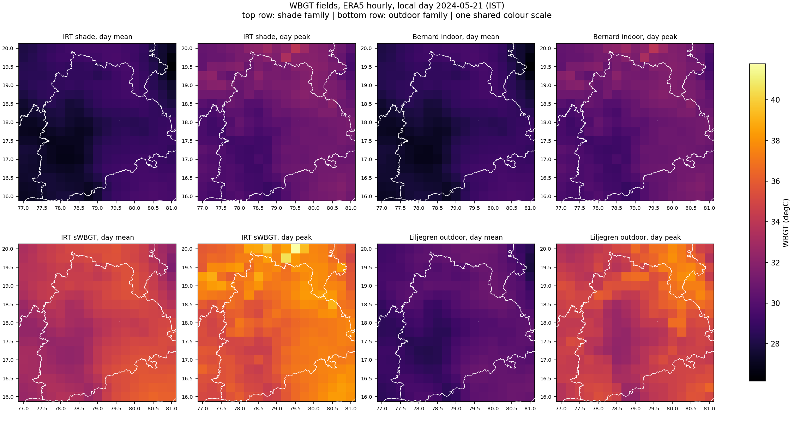
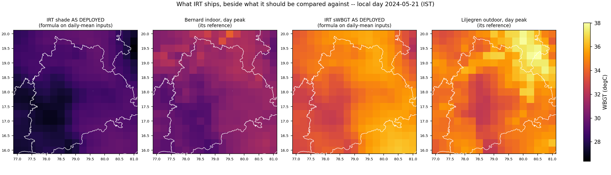
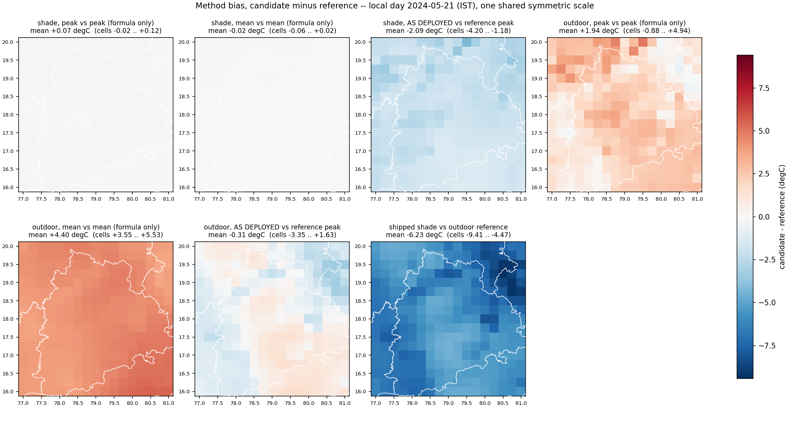
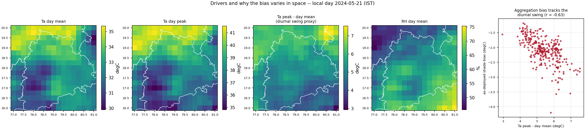

# Spatial maps of the gridded ERA5 WBGT comparison

Local day 2024-05-21 (IST). Rendered by `tools/diagnostics/wbgt_era5_grid_maps.py` from
`per_cell.csv`; the scores these illustrate are in `README.md`. Nothing here is
recomputed, so the maps cannot drift from the table.

## The fields

All eight on one colour scale. The outdoor family sits visibly hotter than the
shade family, and the day-peak panels hotter than the day-mean panels -- the two
axes the comparison separates.

## What IRT actually ships

The AS-DEPLOYED panels are the IRT formulas evaluated on daily-**mean** Ta and RH,
which is what `heat_stress_gridfirst` receives. Each sits beside the day-peak
reference it should be graded against.

## Method bias

Candidate minus reference, one shared symmetric scale. The two `formula only`
shade panels are near-blank at this scale: that is the finding, not a rendering
fault, so every panel carries its own mean and per-cell range. Read across:

- the shade formula reproduces Bernard to within hundredths of a degree;
- evaluating that same formula on daily means costs about two degrees, and the
  cost is **not spatially uniform**;
- sWBGT's small mean outdoor bias is two larger errors cancelling -- a
  radiation-blind formula reading hot, and daily-mean aggregation reading cold --
  which the panel shows as a sign change across the box.

## Drivers

The as-deployed shade bias tracks the diurnal swing: cells that swing further
lose more, because their daily mean sits further below their peak. That is why
the bias is a **ranking** problem for a frozen national CDF ruler and not only a
level problem.
