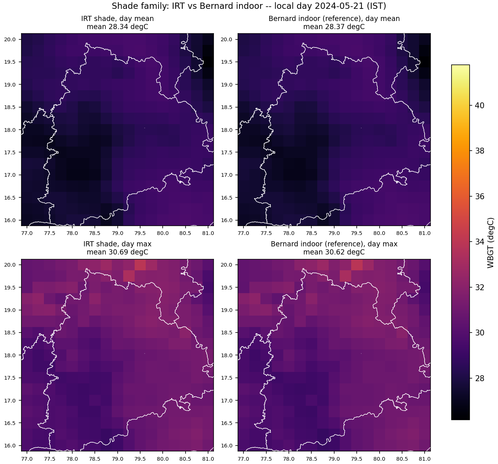
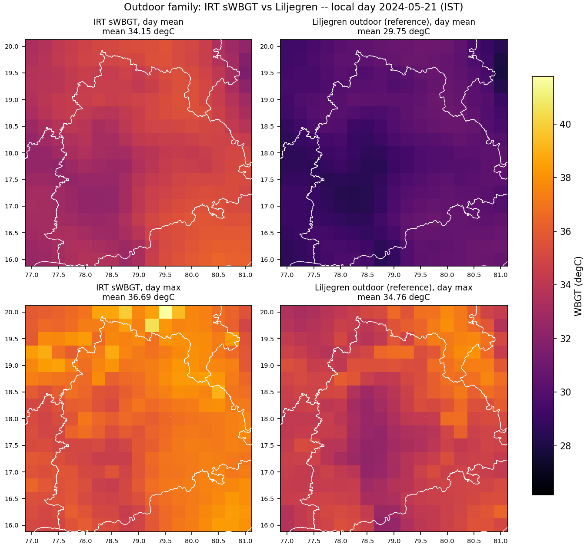

# Spatial maps of the gridded ERA5 WBGT comparison

Local day 2024-05-21 (IST). Rendered by `tools/diagnostics/wbgt_era5_grid_maps.py` from
`per_cell.csv`; the scores these illustrate are in `README.md`. Nothing here is
recomputed, so the maps cannot drift from the table.

Every field figure is laid out the same way: **IRT on the left, its reference on
the right, day mean on top, day max below**. Read across a row for method error
at a fixed aggregation; read down a column for aggregation error at a fixed
method.

## Shade family

IRT shade beside Bernard indoor. The two columns are visually indistinguishable
at both aggregations -- the formula is the method. The top-to-bottom step is the
aggregation gap.

## Outdoor family

IRT sWBGT beside Liljegren outdoor. Here the columns differ: sWBGT carries no
radiation term, so it cannot reproduce the outdoor field cell by cell.

## What IRT actually ships

The AS-DEPLOYED panels are the IRT formulas evaluated on daily-**mean** Ta and RH,
which is what `heat_stress_gridfirst` receives. Each sits beside the day-max
reference it should be graded against.

## Method bias

IRT minus reference, one shared symmetric scale. The two shade panels are
near-blank at this scale: that is the finding, not a rendering fault, so every
panel carries its own mean and per-cell range.

## Drivers

The as-deployed shade bias tracks the diurnal swing: cells that swing further
lose more, because their daily mean sits further below their max. That is why
the bias is a **ranking** problem for a frozen national CDF ruler and not only a
level problem.
